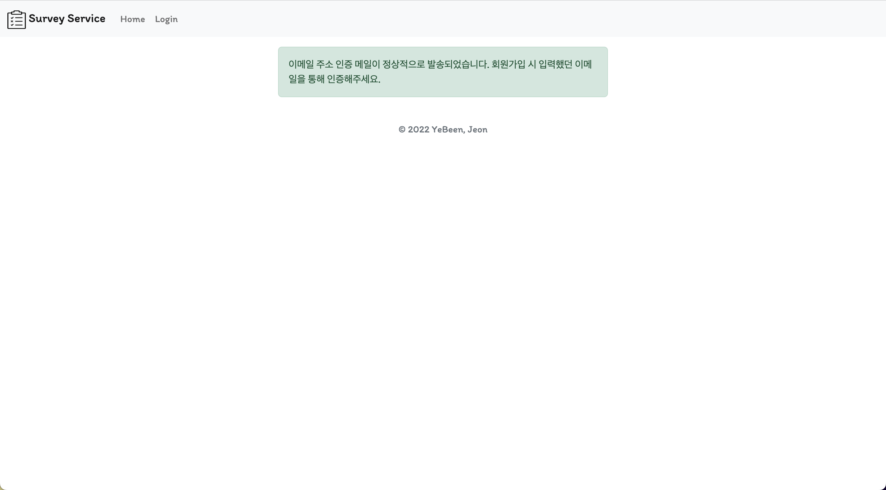

# 📄Survey Service📄

## About

JSP를 공부한 것을 하나의 서비스를 구현하면서 실습하려고 시작했다.

Google Form의 아주 기초적인 기능만을 담은 서비스이다.

 

---

  

## Page 구성

### 로그인 페이지

### 회원가입 페이지

### 이메일 인증 페이지

### 이메일 확인

### 메인 페이지

### Survey Form 만드는 페이지

### 공유 페이지

### 설문 작성 페이지

### 작성 결과 List 확인 - admin

### email 별 응답 확인

