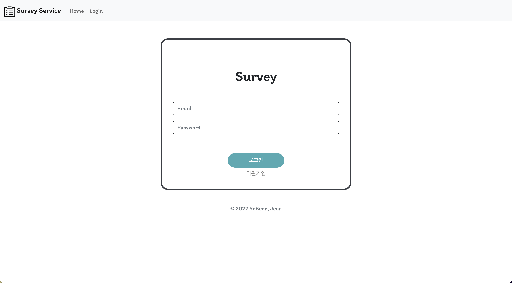
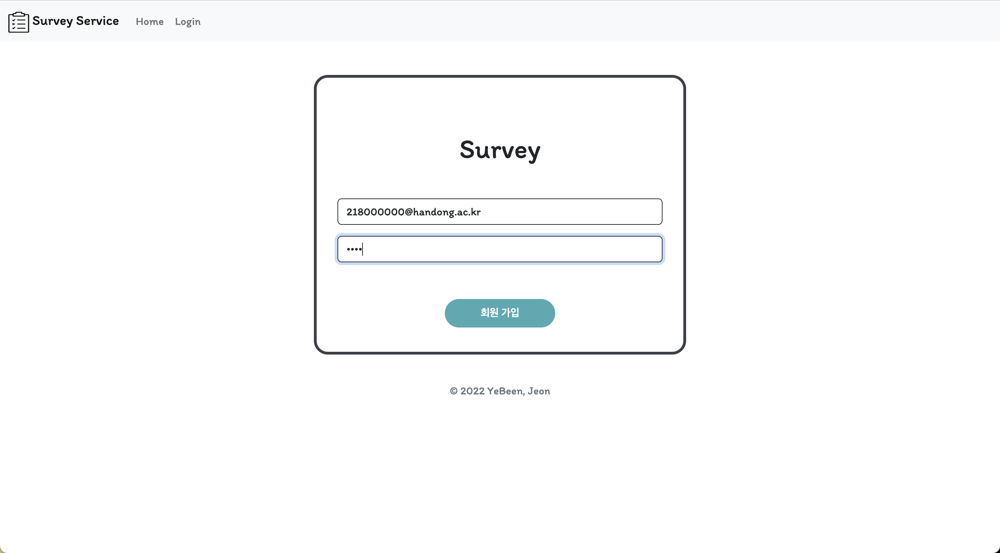
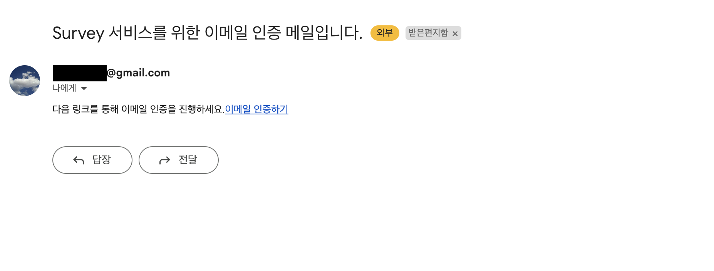
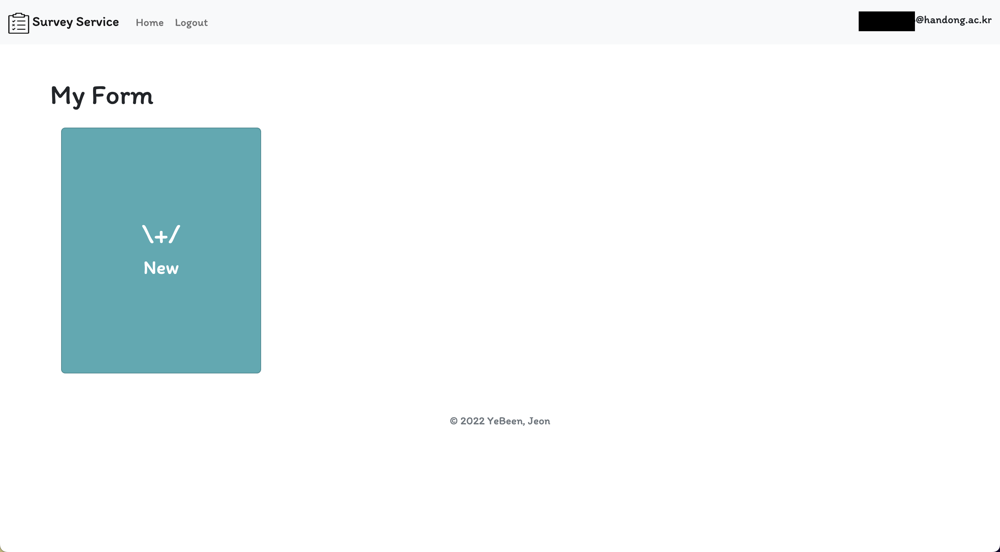
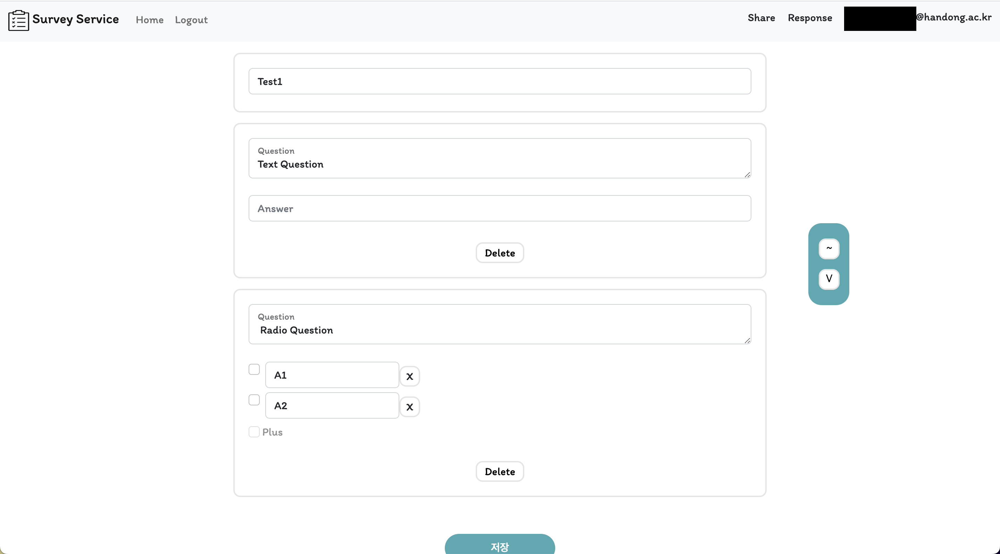
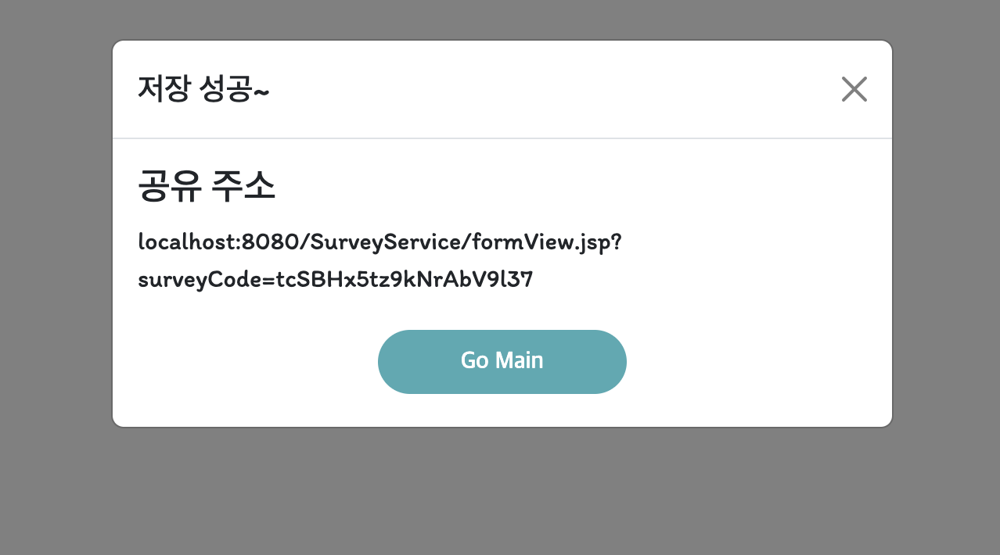
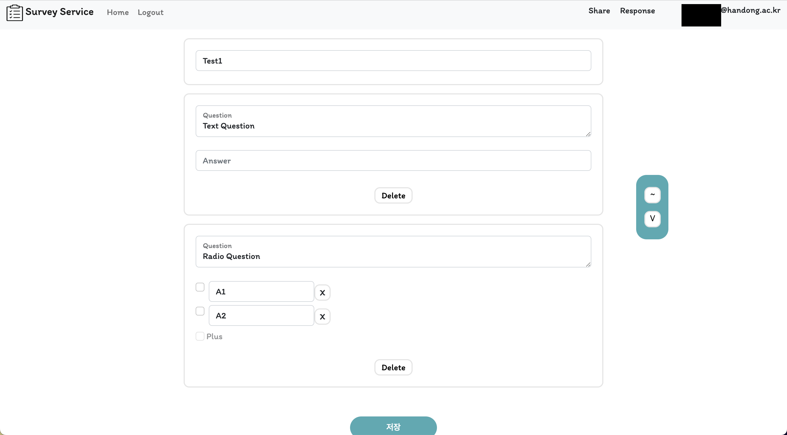
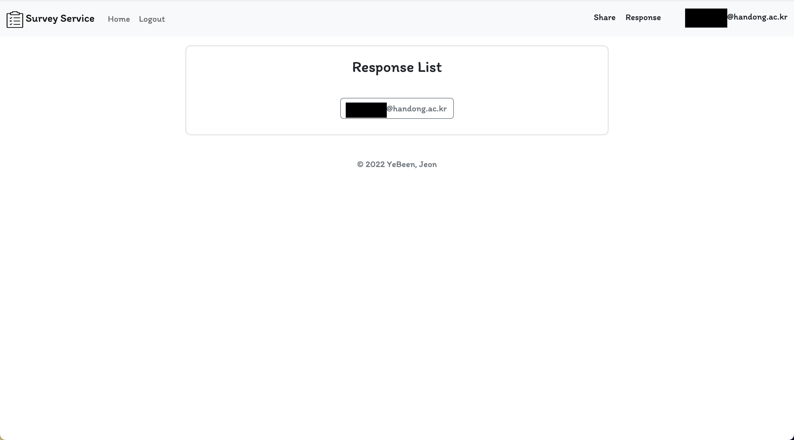
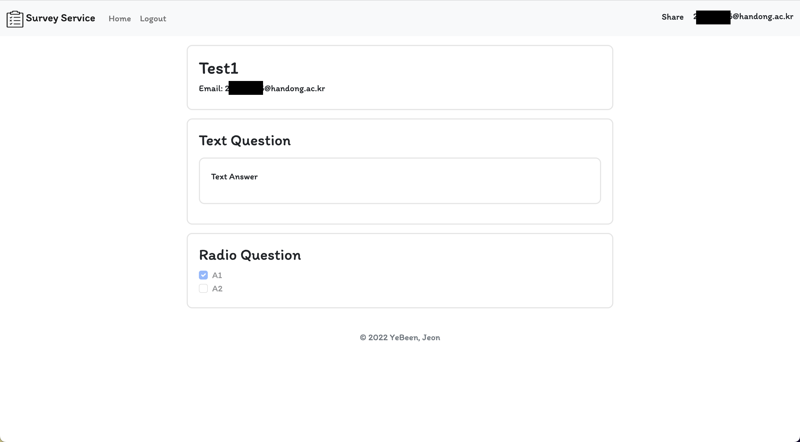

### 로그인 페이지

> 프로젝트의 첫 화면인 로그인 페이지다. 등록한 이메일과 비밀번호를 입력한 후 로그인 버튼을 누른다. 성공적으로 로그인이 되면 Session에 user의 Email이 저장된다.

### 회원가입 페이지

> 등록할 이메일과 비밀번호를 입력한 후 '회원 가입' 버튼을 누른다. 이메일을 통해 인증이 이루어지므로 실제 존재하는 이메일이어야 한다.

### 이메일 인증 페이지

> 회원가입 시 등록한 이메일로 인증을 위한 페이지 링크가 포함된 이메일이 보내진다.

### 이메일 확인

> 이메일에 포함된 링크를 클릭하면 인증이 완료됐다는 문구가 나오고 메인 페이지로 간다.

### 메인 페이지

> 설문지를 관리하고 새로 생성하는 페이지 이다. 'New'를 클릭하면 새로운 설문지를 생성하고 관리하는 페이지로 이동한다. 설문지를 생성하면 카드 형태로 생성되어 보여지는데, 'Edit', 'Delete', 'Response' 버튼이 존재 한다.

### Survey Form 만드는 페이지

> 설문지를 만드는 페이지 이다.   단답형 문제와 다지선다형 문제를 생성할 수 있다. 다지선다형 문제의 요소를 늘리거나 줄일 수 있다.

### 공유 페이지

> 설문지를 완성하고 저장하면 공유를 할 수 있는 링크가 표시된다.

### 설문 작성 페이지

> 공유 링크를 통해 들어간 화면이다. 공유 링크를 받은 사람들은 이 페이지에서 설문의 답을 작성하고 제출 버튼을 클릭한다.

### 작성 결과 List 확인 - admin

> 설문지를 만든 사람은 설문을 작성한 사람들의 이메일을 확인할 수 있다.

### email 별 응답 확인

> 각 이메일을 클릭하면 설문의 응답을 볼 수 있다.
